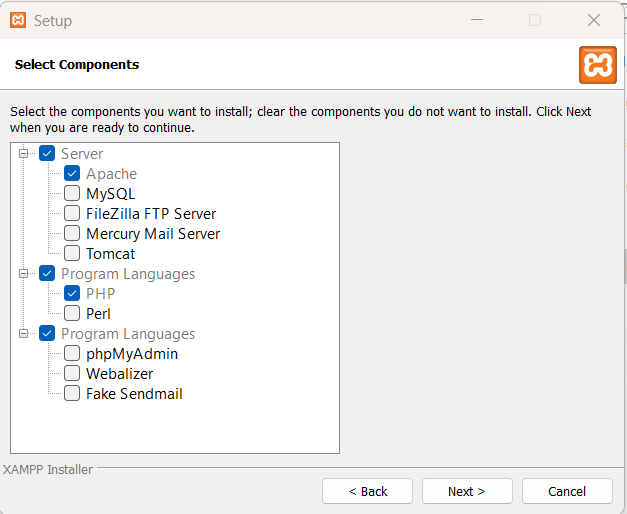
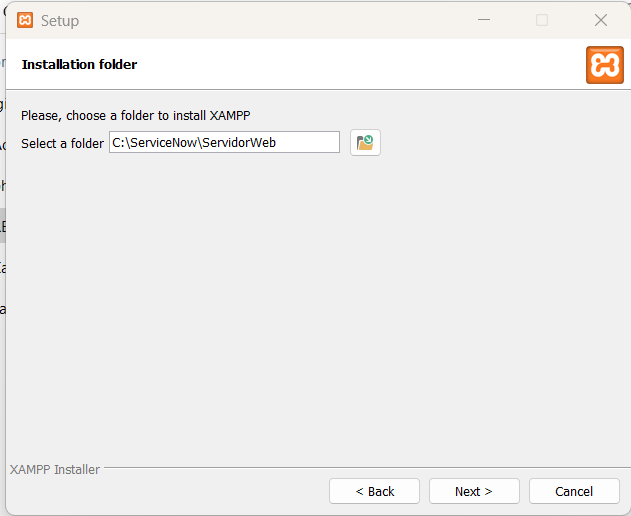
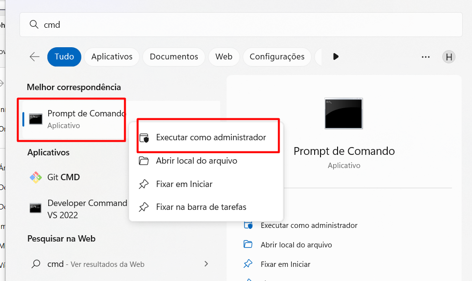
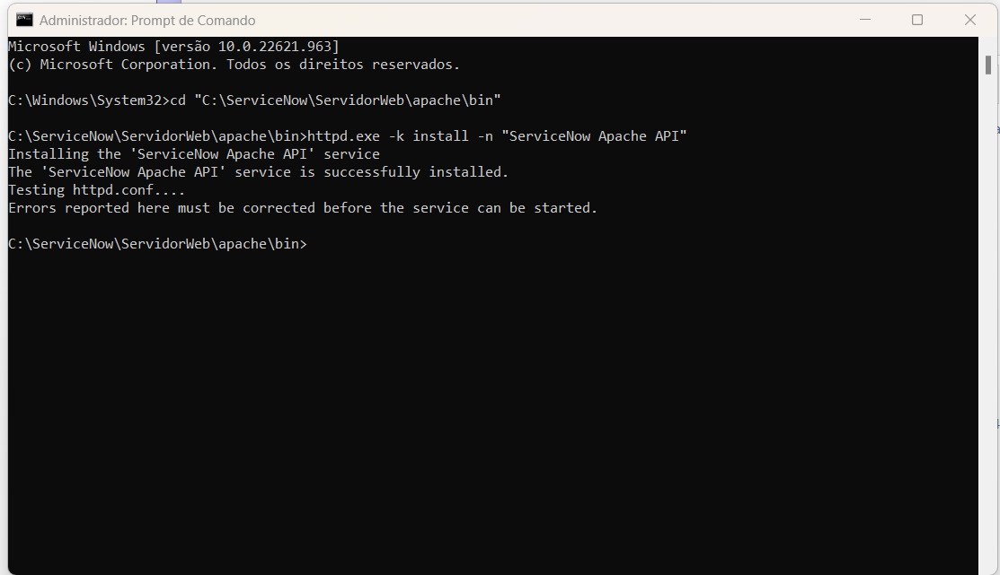

# Manual de Instalação Servidor Web (PHP) com driver do MongoDB

## Download
- [(xampp-windows-x64-7.3.31-3-VC15-installer.exe)](https://sourceforge.net/projects/xampp/files/XAMPP%20Windows/7.3.31/xampp-windows-x64-7.3.31-3-VC15-installer.exe/download)
- [(php_mongodb.dll)](php_mongodb.dll)


## Instalando o Servidor Web

Inicie o instalador
```
xampp-windows-x64-7.3.31-3-VC15-installer.exe
```

Na parte dos componentes

```
Desmarque todos os componentes opcioncionais, onde será instalado apenas os Apache com PHP
```

Definindo o local da Instalação

```
C:\ServiceNow\ServidorWeb
```

Siga a instalação padrão até finalizar e não inicialize o serviço 

## Configurando o driver do MongoDB

Coloque o arquivo php_mongodb.dll em:
```
C:\ServiceNow\ServidorWeb\php\ext
```

Edite o arquivo php.ini em:
```
C:\ServiceNow\ServidorWeb\php\php.ini
```

Adicione a seguinte linha no final do arquivo
```
extension=php_mongodb
```

Salve e feche o arquivo

## Configurando o servidor Web Como Serviço

Abra o CMD.exe como administrador 



Execute os seguites comandos.
```
cd "C:\ServiceNow\ServidorWeb\apache\bin"
httpd.exe -k install -n "ServiceNow Apache API"
```

